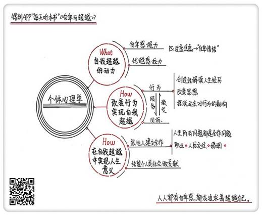

# 《自卑与超越》| 汪花生解读

---

音频文件：[自卑与超越-汪花生解读.mp3](audio/自卑与超越-汪花生解读.mp3)

你将听到：

1. 一个人完成自我超越的根本动力是什么？

2. 为什么说人人都有改变自己的可能？

3. 怎样才能改变自己的行为，完成自我超越？

4. 如何实现人生的意义？

## 核心内容

阿德勒认为，自卑感是人类进步的底层动力；

遗传等先天因素并不能决定人的命运，

每个人都可以通过自己的努力来实现目标，

也可以通过与他人建立合作，来实现自己的人生意义和个人价值。
 
## 个体心理学：（主观能动性）

### 一、自卑感是自我超越的动力

1. 人人都有自卑感

2. 自卑感有可能演变成自卑情结

### 二、人人都可以通过个人努力实现自我超越（认清自己的目标）

遗传、童年经历等先天的生物性因素，并不能决定人的命运，我们每个人都有机会通过自己的努力，来改变自己的行为，完成自我超越。

1. **人可以对自己的经历进行创造性解读**

	童年经历的确会对人造成影响，但却不能决定人的行为。同一种经历可以有多种解读方式，因此，真正束缚我们的不是环境，而是思想。

2. **要改变行为，先从改变目标做起**

	个体心理学认为，真正决定一个人行为的，不是过去的经历，而是未来的目标。我们所有的行为，都是为目标服务的。

	【案例】一位病人长期头痛，多种方法都难以治愈。阿德勒认为，这是他把头疼当做了逃避问题的手段，他在以头疼为借口，来摆脱眼前的问题，如果不明白这个目的，就无法治好他的病。

### 三、人生的意义在于合作

个人要想实现人生意义，就必须与社会建立合作，给全人类创造价值。与他人合作，是实现个人价值的唯一方式。

1. **人生中的所有问题，本质上都是合作问题**

	阿德勒将人生中的所有困难，都归纳成了三个问题：职业问题、人际交往问题和婚姻问题。这些问题都涉及到合作，本质上都是合作问题。

2. **要达成合作，就要把注意力放在合作方身上**

	过度关注自己，是许多问题的根源。为了达成合作，我们需要把注意力从自己身上转移出去，时时刻刻想着自己的合作方。

## 金句

1. 不是遗传或者经历在决定孩子的能力，真正束缚一个人能力的，是他自己的思想。

2. 真正决定一个人行为的，是我们想要达到的那个目标。要想改变自己，就要认清自己的目标。一旦校准目标之后，你就会像弓箭手一样，绷紧身体和精神，让自己的一切行为都为你锚定的这个目标来服务。

3. 一个人的意义，只能在跟别人的交往、合作中才能体现出来。如果你把自己跟别人切割开来，那你的人生意义就等于零。人生唯一的意义，就在于对别人和整个社会做贡献。
